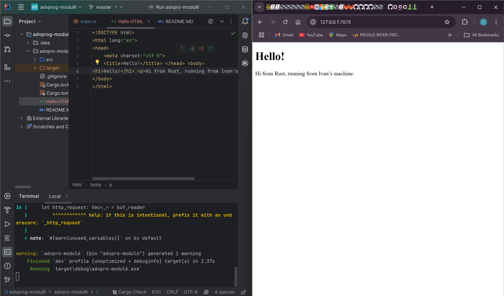

# Advance Programming Module 6: Concurrency

## Table of Contents
* [Milestone 1: Single-threaded Web Server Reflection](#milestone-1-single-threaded-web-server-reflection)
* [Milestone 2: Returning HTML Reflection](#milestone-2-returning-html-reflection)
* [Milestone 3: Validating request and selectively responding Reflection](#milestone-3-validating-request-and-selectively-responding-reflection)
* [Milestone 4: Simulation slow response Reflection](#Milestone-4-Simulation-slow-response-Reflection)
* [Milestone 5:  Multithreaded Server Reflection](#Milestone-5-Multithreaded-Server-Reflection)
* [Bonus Milestone: Enhanced Error Handling in ThreadPool Reflection](#Bonus-Milestone-Reflection-Enhanced-Error-Handling-in-ThreadPool)

# Milestone 1: Single-threaded Web Server Reflection

This is a simple single-threaded web server implemented in Rust. The web server consists of two main functions:

1. `main()`: Sets up a TCP listener and handles incoming connections
2. `handle_connection()`: Processes each individual TCP stream (connection)

### TCP Listener Setup

```rust
let listener = TcpListener::bind("127.0.0.1:7878").unwrap();
```

This binds the server to localhost (`127.0.0.1`) on port `7878`. The use of `unwrap()` ensures that any errors (e.g., if the port is in use) will cause a panic, which is fine for a simple implementation but should be handled more gracefully in production.

### Handling Connections

```rust
for stream in listener.incoming() { 
    let stream = stream.unwrap();
    handle_connection(stream);
}
```

This loop iterates over incoming connections and processes them one at a time. Since the server processes requests sequentially, it cannot handle multiple clients simultaneously, making it a single-threaded server.

### Processing HTTP Requests

```rust
fn handle_connection(mut stream: TcpStream) {
    let buf_reader = BufReader::new(&mut stream);
    let http_request: Vec<_> = buf_reader
        .lines()
        .map(|result| result.unwrap())
        .take_while(|line| !line.is_empty())
        .collect();

    println!("Request: {:#?}", http_request);
}
```

This function is responsible for reading and processing an incoming HTTP request. Here’s a breakdown of what it does:

1. **Creating a buffered reader:**
   ```rust
   let buf_reader = BufReader::new(&mut stream);
   ```
    - This wraps the TCP stream in a `BufReader`, which improves efficiency when reading data by allowing line-by-line processing.

2. **Reading and collecting HTTP request headers:**
   ```rust
   let http_request: Vec<_> = buf_reader
       .lines()
       .map(|result| result.unwrap())
       .take_while(|line| !line.is_empty())
       .collect();
   ```
    - `.lines()`: Reads the incoming TCP stream line by line.
    - `.map(|result| result.unwrap())`: Extracts the actual string content from the `Result<String, Error>` returned by `.lines()`. If an error occurs, `unwrap()` will panic.
    - `.take_while(|line| !line.is_empty())`: Continues collecting lines until it encounters an empty line, which marks the end of the HTTP headers.
    - `.collect()`: Stores the collected lines in a `Vec<String>` for further processing.

3. **Printing the request headers:**
   ```rust
   println!("Request: {:#?}", http_request);
   ```
    - This prints the parsed HTTP request headers in a nicely formatted way for debugging.

### Reflection & Learnings
- **Single-threaded Limitation**: Handling one request at a time means other clients must wait for the current request to finish before being processed.
- **Error Handling**: The code relies heavily on `unwrap()`, which isn't ideal for robustness. Proper error handling should be introduced.
- **Request Parsing**: The server captures HTTP headers but does not process different request types or send responses yet.

# Milestone 2: Returning HTML Reflection


At this stage, the `handle_connection()` function has been improved to generate a structured HTTP response, including a status line, headers, and HTML content. The server now properly responds to client requests by:

- Setting the status line to **`HTTP/1.1 200 OK`** to indicate a successful response.
- Adding a **`Content-Length`** header to specify the size of the response body.
- Using two **CRLF sequences (`\r\n\r\n`)** to separate headers from the response body.
- Serving **HTML content** retrieved from an external file.

To achieve this, the server reads the contents of `hello.html` using `fs::read_to_string()` and transmits the complete response to the client through `stream.write_all()`.

However, there are still some limitations:
- The server always responds with **`200 OK`**, regardless of the request.
- It only serves a **single static file (`hello.html`)**.
- Connections are still processed **sequentially**, meaning the server remains **single-threaded**.

# Milestone 3: Validating request and selectively responding Reflection


In this milestone, the web server has been improved to validate incoming requests and respond accordingly. It now properly handles invalid routes by returning a 404 error page when necessary.

The updated `handle_connection()` function extracts only the request line (the first line of the HTTP request) and uses pattern matching to determine the appropriate response. This allows the server to serve different HTML files based on the requested path.

### Enhancements Implemented:

1. Instead of collecting all HTTP headers, the code now extracts only the request line using `buf_reader.lines().next()`, which contains the HTTP method, path, and version.
2. Utilizing Rust's `match` expression to determine the response:
   - If the request is for the root path (`GET / HTTP/1.1`), the server returns a `200 OK` response with `hello.html`.
   - For any other request, the server responds with a `404 NOT FOUND` and serves `404.html`.
3. The server now dynamically serves different HTML files based on the request, improving user feedback.

### Code Refactoring Benefits:

This update introduces a `match` expression, replacing the traditional `if-else` approach. This refactoring provides several advantages:

1. **Cleaner Code:** Without refactoring, each condition would require duplicating similar logic:

    ```rust
    if request_line == "GET / HTTP/1.1" {
        status_line = "HTTP/1.1 200 OK";
        filename = "hello.html";
    } else {
        status_line = "HTTP/1.1 404 NOT FOUND";
        filename = "404.html";
    }
    ```

2. **Compiler Safety:** The `match` expression ensures all variables are properly initialized for every case, allowing Rust's compiler to verify correctness.
3. **Improved Readability:** Using a tuple to return multiple values from the `match` expression makes the code more concise and reduces the risk of mismatched variables.
4. **Scalability:** Adding new routes and responses is straightforward—simply add a new match arm without duplicating logic.
5. **Safer Code:** The use of immutable variables (`let` instead of `mut`) aligns with Rust's best practices for concurrency and code clarity.

### Current State of the Server:

- Listens for connections on `localhost:7878`
- Parses the HTTP request line
- Responds with `hello.html` and `200 OK` for `/`
- Returns `404.html` with `404 NOT FOUND` for all other paths
- Remains single-threaded, handling one request at a time


# Milestone 4: Simulation slow response Reflection

In this milestone, the web server has been modified to illustrate how slow responses impact a single-threaded server. By introducing a new route that deliberately delays its response, the server now showcases the blocking nature of sequential processing and how it affects handling multiple client requests.

### Key Modification

The `handle_connection()` function has been updated to include a new route handler:

```rust
fn handle_connection(mut stream: TcpStream) {
    let buf_reader = BufReader::new(&mut stream);
    let request_line = buf_reader.lines().next().unwrap().unwrap();

    let (status_line, filename) = match &request_line[..] {
        "GET / HTTP/1.1" => ("HTTP/1.1 200 OK", "hello.html"),
        "GET /sleep HTTP/1.1" => {
            thread::sleep(Duration::from_secs(10));
            ("HTTP/1.1 200 OK", "hello.html")
        },
        _ => ("HTTP/1.1 404 NOT FOUND", "404.html"),
    };

    let contents = fs::read_to_string(filename).unwrap();
    let length = contents.len();
    let response = format!("{status_line}\r\nContent-Length: {length}\r\n\r\n{contents}");
    stream.write_all(response.as_bytes()).unwrap();
}
```
## Changes Introduced

- New Route Handler (`/sleep`)
  - Introduces a **10-second delay** using `thread::sleep(Duration::from_secs(10))`.

- Maintains Functionality
  - After the delay, the server responds with **hello.html**, similar to the root (`/`) route.

- Extended `match` Expression
  - The function now handles **/sleep requests** alongside existing routes.

- Explicit Imports
  - The `thread` module and `Duration` struct from Rust's standard library are now **required**.


## Impact on Server Performance

This update highlights a major limitation of single-threaded servers: **blocking behavior**. When a client requests `/sleep`, the server becomes **unresponsive** to all other requests for **10 seconds**. This happens due to:

- Sequential Request Handling : The server processes connections **one at a time** using `listener.incoming()`.

- Single-Threaded Execution : Only **one connection** is handled at a time.

- Blocking Calls : The server **waits** for `thread::sleep()` to complete before processing the next request.

- Simulated Delay : Represents real-world scenarios where a server might handle **CPU-intensive or I/O-bound operations**.

This behavior reflects how **early web servers** functioned before modern concurrency techniques were introduced.


## Current Capabilities

At this stage, the server can:
- Route requests based on the requested path.
- Demonstrate the effect of slow operations on a single-threaded server.
- Provide a real-world example of blocking behavior in request handling.


## Limitations

Despite these improvements, the server still has several drawbacks:

- Cannot handle multiple requests concurrently.
- Long-running operations block all other clients.
- Vulnerable to denial-of-service attacks due to slow requests.
- Minimal error handling (`unwrap()` is used without safeguards).
- Lacks advanced request handling (e.g., headers, query parameters, POST support).  

## Milestone 5: Multithreaded Server Reflection

In this milestone, the server has been upgraded to support multithreading using a thread pool. This enhancement resolves the performance bottlenecks of the previous single-threaded implementation, enabling concurrent request handling.

### Thread Pool Implementation

The thread pool consists of a fixed number of worker threads that process incoming connections in parallel. When initialized with `ThreadPool::new(4)`, four independent worker threads are created and remain active throughout the server's runtime.

### How It Works:
- The main thread listens for incoming connections and distributes tasks using an MPSC (Multiple Producer, Single Consumer) channel.
- Shared access to this channel is managed through Rust’s concurrency primitives: `Arc` (Atomic Reference Counter) and `Mutex` (Mutual Exclusion).
- Each worker thread continuously polls for jobs, processes them, and returns to an idle state.
- When a request arrives, it is wrapped as a closure and sent to the worker pool via the `execute()` method.

### Performance Improvements

With this multithreaded architecture, the server now:
- Handles multiple client requests simultaneously (up to 4 connections in the current configuration).
- Ensures that long-running requests (e.g., the `/sleep` endpoint) only occupy a single worker, allowing others to remain available.
- Eliminates head-of-line blocking, a major drawback of single-threaded servers.
- Maintains responsiveness even when handling time-intensive operations.

### Key Enhancements

At this stage, the server now:
- Implements **true concurrent request handling** through a thread pool.
- Maintains **existing request routing** but processes requests in parallel.
- Uses **Rust’s concurrency features** to enable thread-safe communication.
- Provides **debugging output** when a worker receives a job (`println!("Worker {id} got a job; executing.")`).

### Implementation Details

To enable multithreading, a new `lib.rs` file was created to implement the `ThreadPool` pattern. The main server code was modified to:
- Instantiate a thread pool with 4 worker threads.
- Submit incoming connections as jobs to the thread pool.
- Process client requests concurrently instead of sequentially.

This transition to a thread pool architecture significantly boosts server efficiency, ensuring smoother and faster request handling, even under high loads.  

## Bonus Milestone Reflection: Enhanced Error Handling in ThreadPool

In this milestone, I've improved the thread pool implementation by introducing a `build` function as an alternative to the `new` constructor. This follows Rust’s best practices for error handling, giving callers greater flexibility when creating a thread pool.

### Key Enhancements

The primary improvement is the addition of the `build` function in the `ThreadPool` implementation:

```rust
pub fn build(size: usize) -> Result<ThreadPool, PoolCreationError> {  
    if size == 0 {  
        return Err(PoolCreationError::ZeroSize);  
    }  

    let (sender, receiver) = mpsc::channel();  
    let receiver = Arc::new(Mutex::new(receiver));  
    let workers = (0..size)  
        .map(|id| Worker::new(id, Arc::clone(&receiver)))  
        .collect::<Vec<Worker>>();  

    Ok(ThreadPool { workers, sender })  
}  
```

### Improvements Introduced

1. **Result-Based Error Handling** – The function returns `Result<ThreadPool, PoolCreationError>` instead of directly constructing a `ThreadPool`, aligning with Rust’s conventions for operations that may fail.
2. **Custom Error Type** – A dedicated `PoolCreationError` enum provides clear failure modes.
3. **Graceful Error Handling** – Instead of panicking with `assert!`, the function returns an `Err` variant for invalid inputs.
4. **Functional Construction** – The worker creation process is streamlined with `map` and `collect`, improving readability.

### Integration with `main.rs`

The `main.rs` file now calls `build`, allowing failure handling:

```rust
let pool = ThreadPool::build(4).expect("Failed to create ThreadPool!");
```

This example still uses `expect` for simplicity, but in production, more sophisticated error handling could be implemented.

### Comparing `new` and `build`

1. **`new` Function**
    - Uses `assert!(size > 0)`, leading to a panic on failure.
    - Follows Rust’s convention that constructors named `new` shouldn’t fail or return `Result`.
    - Suitable when invalid inputs indicate a programming error.

2. **`build` Function**
    - Returns `Result<ThreadPool, PoolCreationError>` to explicitly indicate failure.
    - Allows calling code to handle errors gracefully.
    - More appropriate when failure is expected or recoverable.
    - Enables structured error handling.

### Custom Error Type

```rust
#[derive(Debug)]
pub enum PoolCreationError {
    ZeroSize,
}
```

The `#[derive(Debug)]` attribute makes the error easily printable, aiding debugging.

### Summary

This enhancement makes the thread pool implementation more robust by:

- Adopting Rust’s error-handling best practices using `Result`.
- Providing a more flexible and recoverable thread pool creation method.
- Introducing a custom error type for clearer diagnostics.
- Maintaining all concurrency benefits from previous milestones.